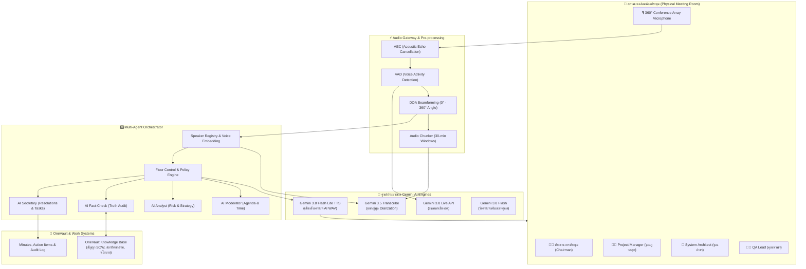
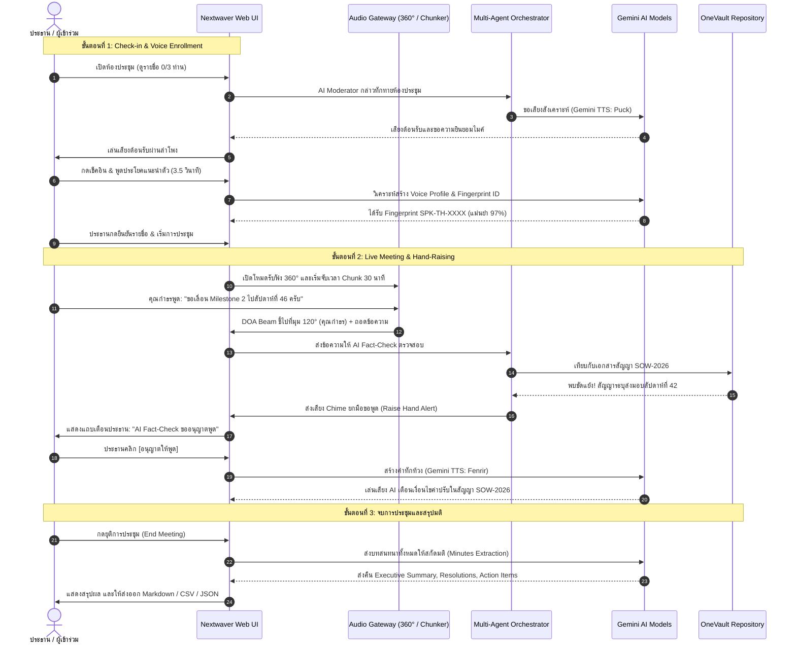
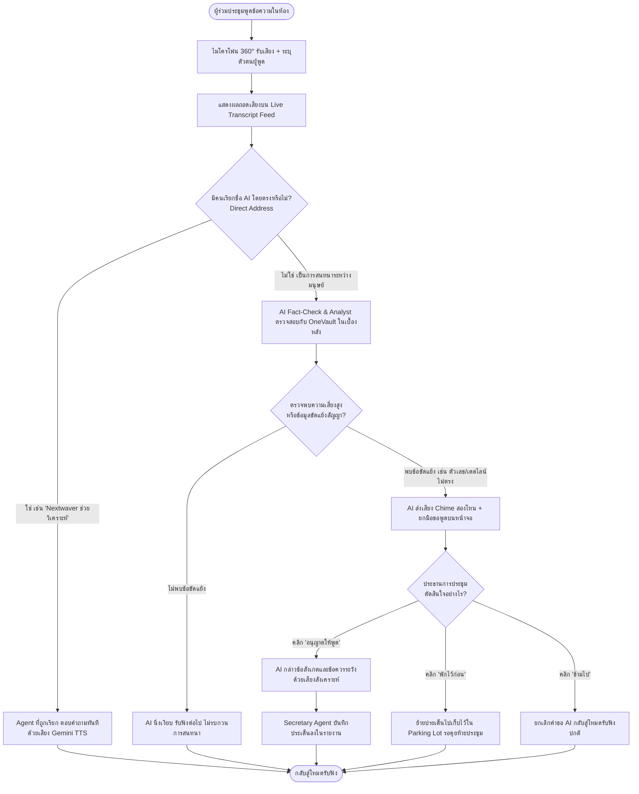
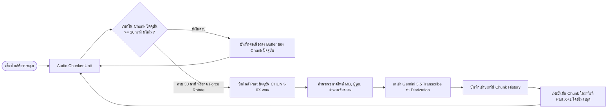

# Nextwaver AI Meeting Team — คู่มือการใช้งานและเอกสารระบบฉบับสมบูรณ์ (User Manual & System Guide)

> **ระบบประชุมอัจฉริยะแบบ Multi-Agent ขับเคลื่อนด้วย Gemini Live API, 360° Conference Audio, Speaker Identification และ OneVault Context Integration**  
> *คู่มือฉบับนี้ออกแบบสำหรับผู้ใช้งานระดับเริ่มต้น (Beginner) ไปจนถึงผู้ดูแลระบบ (Administrator) เพื่อให้เข้าใจกระบวนการทำงานและสามารถใช้งานระบบได้อย่างเป็นขั้นตอน*

---

## 📑 สารบัญ
1. [บทนำ: Nextwaver AI Meeting Team คืออะไร?](#1-บทนำ-nextwaver-ai-meeting-team-คืออะไร)
2. [สถาปัตยกรรมและแผนผังการทำงาน (System Architecture & Mermaid Diagrams)](#2-สถาปัตยกรรมและแผนผังการทำงาน)
   - [2.1 แผนผังสถาปัตยกรรมระบบ (System Architecture Diagram)](#21-แผนผังสถาปัตยกรรมระบบ)
   - [2.2 แผนผังลำดับขั้นตอนการใช้งาน (User Journey Sequence Diagram)](#22-แผนผังลำดับขั้นตอนการใช้งาน)
   - [2.3 แผนผังการตัดสินใจของ AI และการยกมือทักท้วง (Floor Control Flowchart)](#23-แผนผังการตัดสินใจของ-ai)
   - [2.4 แผนผังการแบ่งช่วงไฟล์เสียง 30 นาที (Audio Chunking Flowchart)](#24-แผนผังการแบ่งช่วงไฟล์เสียง-30-นาที)
3. [คู่มือการใช้งานทีละขั้นตอนสำหรับผู้เริ่มต้น (Step-by-Step Beginner Guide)](#3-คู่มือการใช้งานทีละขั้นตอนสำหรับผู้เริ่มต้น)
   - [ขั้นตอนที่ 1: การลงทะเบียนเสียงและเช็คอิน (Voice Check-in & Enrollment)](#ขั้นตอนที่-1-การลงทะเบียนเสียงและเช็คอิน)
   - [ขั้นตอนที่ 2: เริ่มการประชุมและการรับฟังรอบทิศทาง 360° (360° Room Listening)](#ขั้นตอนที่-2-เริ่มการประชุมและการรับฟังรอบทิศทาง-360)
   - [ขั้นตอนที่ 3: การสนทนาและให้ AI มีส่วนร่วม (Direct Address & Proactive Hand-Raising)](#ขั้นตอนที่-3-การสนทนาและให้-ai-มีส่วนร่วม)
   - [ขั้นตอนที่ 4: การจัดการช่วงไฟล์เสียงบันทึก 30 นาที (Audio Chunk Manager)](#ขั้นตอนที่-4-การจัดการช่วงไฟล์เสียงบันทึก-30-นาที)
   - [ขั้นตอนที่ 5: การสรุปมติ, รายการงาน และการส่งออกรายงาน (Data Hub)](#ขั้นตอนที่-5-การสรุปมติ-รายการงาน-และการส่งออกรายงาน)
   - [ขั้นตอนที่ 6: การนำเข้าข้อมูลบทสนทนาย้อนหลังและให้ AI วิเคราะห์มติทันที](#ขั้นตอนที่-6-การนำเข้าข้อมูลบทสนทนาย้อนหลัง)
4. [พจนานุกรมศัพท์เทคนิคภายในระบบ (Technical Glossary)](#4-พจนานุกรมศัพท์เทคนิคภายในระบบ)
5. [คำถามที่พบบ่อยและการแก้ไขปัญหาเบื้องต้น (FAQ & Troubleshooting)](#5-คำถามที่พบบ่อยและการแก้ไขปัญหาเบื้องต้น)

---

## 1. บทนำ: Nextwaver AI Meeting Team คืออะไร?

ในอดีต โปรแกรมบันทึกการประชุม AI ทั่วไปทำหน้าที่เพียง **"ผู้ถอดเทปแบบเงียบๆ (Passive Note-taker)"** ที่รอให้การประชุมจบลงแล้วจึงสรุปผล ซึ่งมักพบปัญหา:
- AI ไม่รู้ว่าใครเป็นคนพูด ทำให้ระบุผู้รับผิดชอบงานผิดคน
- AI ไม่รู้ว่าข้อมูลที่พูดในห้องประชุม ขัดแย้งกับสัญญาหรือข้อตกลงเดิมในบริษัทหรือไม่
- AI ไม่มีโอกาสช่วยเตือนความเสี่ยงในจังหวะเวลาที่ทีมกำลังถกเถียงกันอยู่

**Nextwaver AI Meeting Team** จึงถูกพัฒนาขึ้นเพื่อเปลี่ยน AI ให้กลายเป็น **"สมาชิกทีมที่มีชีวิตร่วมประชุมจริง (Active AI Team Member)"**:
1. **รู้จักเสียงทุกคนก่อนเริ่มประชุม**: ผ่านขั้นตอน Voice Check-in จับคู่เสียงกับชื่อและตำแหน่งที่ยืนยันแล้ว
2. **ฟังเสียงรอบทิศทาง 360°**: ใช้ไมโครโฟนตรวจจับทิศทางเสียงผู้พูด (Beamforming & DOA) พร้อมระบบตัดเสียงสะท้อน (AEC)
3. **ทำงานเป็นทีม 4 Agent**:
   - 🛡️ **AI Moderator**: คอยดูวาระการประชุม รักษาเวลา จัดสรรลำดับผู้พูด
   - 📊 **AI Analyst**: วิเคราะห์ข้อดี-ข้อเสีย ประเมินความเสี่ยง และผลกระทบเชิงกลยุทธ์
   - 🔍 **AI Fact-Check**: ตรวจสอบคำพูดเทียบกับคลังสัญญาและเอกสาร **OneVault** แบบเรียลไทม์
   - 📝 **AI Secretary**: บันทึกมติที่เห็นชอบ แจกแจง Action Items และประเด็นคั่งค้าง (Parking Lot)
4. **ไม่พูดแทรกมนุษย์**: AI จะตอบเมื่อถูกเรียกถามตรงๆ หรือ **"ยกมือขออนุญาตประธาน (Proactive Hand-Raising)"** เมื่อพบข้อมูลขัดแย้ง โดยประธานในห้องประชุมเป็นผู้มีอำนาจสั่งให้พูดหรือไม่พูด

---

## 2. สถาปัตยกรรมและแผนผังการทำงาน (Mermaid Diagrams)

### 2.1 แผนผังสถาปัตยกรรมระบบ (System Architecture Diagram)

---

### 2.2 แผนผังลำดับขั้นตอนการใช้งาน (User Journey Sequence Diagram)

---

### 2.3 แผนผังการตัดสินใจของ AI และการยกมือทักท้วง (Floor Control Flowchart)

---

### 2.4 แผนผังการแบ่งช่วงไฟล์เสียง 30 นาที (Audio Chunking Flowchart)

---

## 3. คู่มือการใช้งานทีละขั้นตอนสำหรับผู้เริ่มต้น (Step-by-Step Beginner Guide)

### ขั้นตอนที่ 1: การลงทะเบียนเสียงและเช็คอิน (Voice Check-in & Enrollment)
ก่อนเริ่มการประชุม AI จำเป็นต้องรู้จักเสียงของผู้เข้าร่วมทุกคน เพื่อให้การระบุชื่อผู้พูดและผู้รับผิดชอบงานถูกต้อง 100%

1. เข้ามาที่แถบเมนู **`Check-in (เสียง)`** จะพบรายชื่อผู้เข้าร่วมประชุมที่นัดหมายไว้ (เช่น คุณภูวกฤต, คุณกำธร, คุณนวพร)
2. คลิกปุ่ม **`AI ทักทายห้องประชุม`** เพื่อให้ AI Moderator กล่าวต้อนรับและขอความยินยอมการใช้ไมโครโฟน
3. ให้สมาชิกแต่ละคนคลิก **`AI เชิญให้คุณ [ชื่อ] แนะนำตัว`**
4. เลือกรูปแบบการบันทึกเสียง:
   - **บันทึกไมค์จริง**: กดแล้วให้ผู้เข้าร่วมพูดประโยคแนะนำตัวสั้นๆ ประมาณ 3.5 วินาที
   - **ทดสอบเสียงจำลอง**: สำหรับการทดลองเล่นระบบโดยไม่ต้องเปิดไมค์จริง
5. ระบบจะวิเคราะห์คลื่นเสียงและสร้าง **Voice Profile** แสดงค่า:
   - **Speaker Fingerprint ID** (เช่น `SPK-TH-8421`)
   - **โทนเสียง (Pitch Band)** และความคมชัด (SNR dB)
   - สถานะจะเปลี่ยนเป็นเครื่องหมายถูกสีเขียว **"ยืนยันเสียงแล้ว"**
6. หากต้องการเพิ่มผู้ร่วมประชุม สามารถคลิกปุ่ม **`+ เพิ่มผู้เข้าร่วม`** ได้ตลอดเวลา
7. เมื่อทุกคนยืนยันครบ ให้ประธานคลิก **`ประธานยืนยันและเริ่มประชุม`**

---

### ขั้นตอนที่ 2: เริ่มการประชุมและการรับฟังรอบทิศทาง 360° (360° Room Listening)
เมื่อเริ่มการประชุม ระบบจะสลับมาที่หน้าจอ **`ห้องประชุม 360°`**:

1. **โต๊ะประชุมทรงกลม 360°**: แสดงตำแหน่งที่นั่งของสมาชิกแต่ละท่านรอบโต๊ะ
2. **ไมโครโฟน Array ตรงกลาง**: จะมีเส้นเรดาร์ **Beamforming** หมุนชี้ไปยังองศา (0°–360°) ของผู้ที่กำลังพูดอัตโนมัติ
3. **วงแหวนเสียงเรืองแสง (Audio Glow)**: จะกระพริบรอบตัวของผู้ที่กำลังพูดอยู่
4. **เปิดไมโครโฟนจริง**: คลิกปุ่ม **`ไมค์สด`** บนแถบด้านบน เพื่อให้ระบบจับเสียงจริงจากไมค์ห้องประชุม หรือสามารถคลิกที่รูปผู้เข้าร่วมคนใดก็ได้เพื่อจำลองการพูด

---

### ขั้นตอนที่ 3: การสนทนาและให้ AI มีส่วนร่วม (Direct Address & Hand-Raising)
ในการประชุม AI จะเข้าร่วมด้วย 2 รูปแบบ:

#### รูปแบบที่ 1: เรียกถาม AI โดยตรง (Direct Address)
- สมาชิกสามารถพูดชื่อ Agent หรือพิมพ์ถาม เช่น *"AI Analyst ช่วยวิเคราะห์ความเสี่ยงเรื่องนี้หน่อย"*
- หรือคลิกปุ่มลัดใต้กล่องถาม เช่น *"วิเคราะห์ผลกระทบด้านความเสี่ยงต่อ Milestone 2"*
- AI จะตอบกลับเป็นข้อความบนจอ พร้อมส่งเสียงพูดสดด้วยเทคโนโลยี **Gemini 3.8 Flash Lite TTS** ทันที

#### รูปแบบที่ 2: AI ยกมือขอพูดเชิงรุก (Proactive Hand-Raising) & ตรวจหลักฐาน OneVault
- หากมีผู้พูดข้อมูลที่ขัดแย้งกับสัญญา OneVault (เช่น เสนอเลื่อนวันส่งมอบ หรือของบประมาณเกินเพดาน)
- AI Fact-Check จะส่งเสียง Chime เตือนสองโทน และแสดงแถบเตือนสีทอง: **"AI ขออนุญาตเสนอความคิดเห็น"**
- **🔍 OneVault Smart Citation Inspector**: ประธานหรือสมาชิกสามารถคลิกปุ่ม **`[🔍 ตรวจหลักฐาน SOW-2026]`** เพื่อเปิดหน้าต่างเทียบคำพูดกับข้อความสัญญาฉบับจริงใน OneVault แบบข้อความต่อข้อความ พร้อมคะแนนความเชื่อมั่นก่อนตัดสินใจ
- ประธานสามารถเลือกกดปุ่มได้ 3 ทาง:
  - **`อนุญาตให้พูด`**: AI จะพูดข้อสังเกตและเตือนเงื่อนไขสัญญาให้ที่ประชุมทราบ ด้วยเสียง Gemini TTS (Fenrir)
  - **`พักไว้ก่อน`**: เลื่อนประเด็นนี้ไปคุยต่อใน Parking Lot ท้ายประชุม
  - **`ข้ามไป`**: ปิดการแจ้งเตือนและประชุมต่อตามปกติ
- **Adaptive Voice Calibration**: หากมีการแก้ไขชื่อผู้พูดใน Live Transcript ระบบจะแสดงข้อความยืนยันการปรับเทียบ Voice Embedding ของผู้พูดนั้นอัตโนมัติ เพื่อเพิ่มความแม่นยำในการจับคู่เสียงรอบถัดไป

---

### ขั้นตอนที่ 4: การจัดการช่วงไฟล์เสียงบันทึก 30 นาที (Audio Chunk Manager)
เพื่อป้องกันปัญหาไฟล์เสียงยาวเกินไปและสอดคล้องกับข้อจำกัดของโมเดลถอดเสียงที่รับไฟล์ได้ไม่เกิน 30 นาทีต่อคำขอ:

1. คลิกที่แถบเมนู **`แบ่งช่วงเสียง 30m`**
2. จะเห็นแถบ Progress Bar แสดงเวลาที่บันทึกไปแล้วในรอบปัจจุบัน (เช่น `14:20 / 30:00 นาที`)
3. **Auto-Rotate**: เมื่อครบ 30 นาที ระบบจะตัดรอบไฟล์เป็น `Part 1`, `Part 2` อัตโนมัติ โดยที่เสียงไม่ขาดตอน
4. **ตัดช่วงตอนนี้ (Force Rotate Now)**: หากประธานต้องการตัดรอบบันทึกทันทีเพื่อทดสอบ สามารถกดปุ่มนี้ได้เลย
5. **ดาวน์โหลดไฟล์เสียง WAV จริง (Playable WAV)**: ในตารางประวัติ คลิกปุ่ม **`ดาวน์โหลด`** เพื่อดาวน์โหลดไฟล์เสียงบันทึก `.wav` คุณภาพสูงที่เปิดเล่นได้ทันทีในเครื่องคอมพิวเตอร์
6. **ฟังเสียงย้อนหลัง (Play Audio)**: คลิกปุ่ม **`ฟังเสียง`** เพื่อฟังเสียงบันทึกย้อนหลังพร้อมแถบกราฟคลื่นเสียง Waveform เคลื่อนไหว

---

### ขั้นตอนที่ 5: การสรุปมติ, รายการงาน และการส่งออกรายงาน (Data Hub)
เมื่อการประชุมเสร็จสิ้น ให้คลิกปุ่ม **`ปิดประชุม / สรุปมติ`** หรือคลิกแถบ **`มติ & สรุปผล`**:

1. **Executive Summary**: สรุปใจความสำคัญของการประชุมใน 3-4 ประโยค
2. **Approved Resolutions**: มติที่ได้รับความเห็นชอบอย่างเป็นเอกฉันท์
3. **Action Items Advanced Management**:
   - **ตัวกรองอัจฉริยะ**: กรองงานตามผู้รับผิดชอบ (คุณภูวกฤต / กำธร / นวพร), ความสำคัญ (HIGH / MEDIUM / LOW), หรือสถานะ
   - **เพิ่มงานใหม่แบบ Inline**: คลิก **`+ เพิ่มงานใหม่`** เพื่อเพิ่ม Action Item พร้อมระบุผู้รับผิดชอบ กำหนดส่ง และความสำคัญได้ทันที
   - **คัดลอกสำหรับ Jira / Slack**: คลิก **`คัดลอก Jira / Slack`** เพื่อนำข้อความในรูปแบบ Markdown Checklist ไปโพสต์ลงใน Slack Channel หรือสร้าง Ticket ใน Jira ทันที
4. **ซิงค์มติเข้า OneVault (Sync to OneVault)**:
   - คลิกปุ่ม **`ซิงค์มติเข้า OneVault`** บนแถบด้านบน เพื่อบันทึกมติและ Action Items เข้าเป็นเอกสารสัญญา/นโยบายรับรองฉบับใหม่ในคลังความรู้ OneVault ทันที ทำให้ AI Fact-Check สามารถนำมตินี้ไปใช้เป็นฐานข้อมูลอ้างอิงในการประชุมครั้งต่อไปได้
5. **Parking Lot**: ประเด็นที่ยังถกเถียงค้างคาและต้องนัดหารือนอกรอบ
6. คลิกปุ่ม **`AI สรุปมติสดใหม่`** หากต้องการให้ Gemini ประมวลผลบทสนทนาล่าสุดใหม่อีกครั้ง
7. คลิกปุ่ม **`Data Hub (นำเข้า/ส่งออก)`** บนแถบด้านบน เพื่อเลือกรูปแบบการส่งออก Markdown (.md), CSV (.csv), JSON หรือ Print PDF ทันที

---

### ขั้นตอนที่ 6: การนำเข้าข้อมูลบทสนทนาย้อนหลัง
หากคุณมีบันทึกการประชุมเก่า หรือต้องการทดสอบการทำงานของระบบ:

1. คลิกปุ่ม **`Data Hub (นำเข้า/ส่งออก)`**
2. เลือกแท็บ **`นำเข้าบทสนทนา & วิเคราะห์มติ`**
3. สามารถเลือกกด **1-Click Sample Scenarios** ได้ทันที:
   - *ตัวอย่าง 1: Sprint 24 & SOW* (ประเด็นขอเลื่อนส่งมอบ)
   - *ตัวอย่าง 2: Cloud Incident Post-Mortem* (ถอดบทเรียนระบบล่ม)
   - *ตัวอย่าง 3: Budget Planning* (พิจารณางบประมาณ)
4. หรือวางข้อความบทสนทนาในรูปแบบ `ชื่อผู้พูด: เนื้อหา`
5. หากติ๊กเลือก **"ให้ AI สรุปมติและสร้างรายงานอัตโนมัติ"** ระบบจะวิเคราะห์และสร้างมติการประชุมชุดใหม่ให้ทันที

---

## 4. พจนานุกรมศัพท์เทคนิคภายในระบบ (Technical Glossary)

| คำศัพท์เทคนิค | คำอธิบายฉบับเข้าใจง่าย |
|---|---|
| **Gemini Live API** | บริการปัญญาประดิษฐ์สนทนาเสียงสดสองทางแบบความหน่วงต่ำ (Low Latency) ทำให้ AI สามารถฟังและโต้ตอบด้วยเสียงได้อย่างเป็นธรรมชาติเหมือนมนุษย์ |
| **Gemini 3.5 Transcribe** | โมเดลแปลงเสียงเป็นข้อความที่รองรับการแยกแยะผู้พูด (Speaker Diarization) สูงสุด 8 คน พร้อมระบุช่วงเวลาเริ่มต้น-สิ้นสุดของแต่ละประโยค |
| **Gemini 3.8 Flash Lite TTS** | โมเดลสร้างเสียงสังเคราะห์ AI แบบความเร็วสูง โดยสร้างไฟล์เสียง WAV คุณภาพสูง (24kHz Mono 16-bit) กลับมายังเบราว์เซอร์ทันที |
| **360° Array Microphone** | ชุดไมโครโฟนหลายตัวที่จัดเรียงเป็นวงกลม สามารถรับเสียงได้รอบทิศทาง 360 องศา และคำนวณตำแหน่งที่นั่งของผู้พูดในห้อง |
| **Beamforming & DOA** | **Direction of Arrival (DOA)** คือการคำนวณมุมองศา (0°–360°) ของคลื่นเสียง เพื่อให้ระบบหันลำคลื่นการรับเสียง (Beamforming) ไปหาผู้พูดและตัดเสียงรบกวนรอบข้าง |
| **AEC (Acoustic Echo Cancellation)** | ระบบตัดเสียงสะท้อน ป้องกันไม่ให้เสียงของ AI ที่ดังออกจากลำโพง วนกลับเข้าไปในไมโครโฟนจนเกิดเสียงหวีดหรือเสียงสะท้อนซ้ำ |
| **VAD (Voice Activity Detection)** | ระบบตรวจจับคลื่นเสียงมนุษย์ เพื่อแยกแยะว่าช่วงเวลาใดมีคนกำลังพูดอยู่จริง และช่วงเวลาใดเป็นเพียงเสียงลมหรือความเงียบ |
| **Speaker Diarization** | กระบวนการตอบคำถามว่า *"ใครพูดอะไร ในเวลาใด"* (Who spoke when) โดยจับคู่เสียงเข้ากับตัวตนของผู้พูด |
| **Speaker Fingerprint ID** | รหัสชีวมิติเสียงเฉพาะบุคคล (เช่น `SPK-TH-8421`) ที่สกัดจากโทนเสียงและความถี่ เพื่อใช้จดจำเสียงตลอดการประชุม |
| **Confidence Heatmap (<90%)** | แถบแสดงระดับความเชื่อมั่น Diarization แบบ Heatmap ไฮไลต์ส่วนที่มีความแม่นยำต่ำกว่า 90% เป็นสีแดง พร้อมแจ้งเตือนให้ผู้ใช้กด "ยืนยันผู้พูด" หรือ "เปลี่ยนผู้พูด" เพื่อความสมบูรณ์ของบันทึกการประชุม |
| **Multi-Agent Orchestrator** | ระบบวาทยกรที่ควบคุมการทำงานร่วมกันของ AI ทั้ง 4 ตน (Moderator, Analyst, Fact-Check, Secretary) ให้ทำหน้าที่สอดประสานกัน |
| **Floor Control** | กฎการควบคุมสิทธิ์การพูดในห้องประชุม เพื่อป้องกันไม่ให้ AI พูดแทรกมนุษย์ โดยต้องขออนุญาตประธานก่อนเสมอ |
| **Audio Chunking (30 นาที)** | การแบ่งไฟล์เสียงออกเป็นช่วงๆ ละ 30 นาที เพื่อป้องกันการสูญหายของข้อมูล และสอดคล้องกับข้อจำกัดความยาวไฟล์ของโมเดลถอดเสียง |
| **OneVault Knowledge Base** | คลังจัดเก็บข้อมูล เอกสารสัญญา สเปกระบบ และมติที่ประชุมที่ได้รับอนุมัติ ซึ่ง AI ใช้เป็นแหล่งอ้างอิงความจริงในการตรวจสอบ |

---

## 5. คำถามที่พบบ่อยและการแก้ไขปัญหาเบื้องต้น (FAQ & Troubleshooting)

#### Q1: ทำไมต้องมีการลงทะเบียนเสียง (Voice Check-in) ก่อนเริ่มประชุม?
> **ตอบ**: เพราะไมโครโฟนตัวเดียวในห้องประชุมไม่สามารถรู้ชื่อคนพูดได้อัตโนมัติ การให้แต่ละคนพูดแนะนำตัวสั้นๆ 3.5 วินาที จะทำให้ระบบสร้าง Speaker Profile เพื่อจับคู่เสียงกับชื่อได้อย่างแม่นยำ ป้องกันการลงมติหรือมอบหมายงานผิดคน

#### Q2: หากระบบจับคู่ชื่อผู้พูดผิดในระหว่างประชุม สามารถแก้ไขได้หรือไม่?
> **ตอบ**: ได้ทันทีครับ ในทุกข้อความบนแถบ **Live Transcript** จะมีปุ่ม **`แก้ชื่อผู้พูด`** ให้คลิกเพื่อเลือกเปลี่ยนเป็นชื่อผู้เข้าร่วมท่านอื่นได้ทันที

#### Q3: ทำไมจึงต้องแบ่งไฟล์เสียงเป็นช่วงละ 30 นาที?
> **ตอบ**: เนื่องจากบริการถอดเสียงแบบแยกผู้พูด (Gemini 3.5 Transcribe with Diarization) มีข้อกำหนดทางเทคนิคจำกัดความยาวไฟล์ไม่เกิน 30 นาทีต่อหนึ่งคำขอ การแบ่งช่วงละ 30 นาทีจึงช่วยให้การประมวลผลแม่นยำ ไม่ติด Error และปลอดภัยต่อข้อมูลสูญหาย

#### Q4: หากไมโครโฟนจริงใช้งานไม่ได้ สามารถทดสอบระบบได้อย่างไร?
> **ตอบ**: ระบบมีปุ่ม **`จำลองสถานการณ์การประชุม (Interactive Meeting Scenarios)`** เช่น ข้อเสนอเลื่อนส่งมอบ, ขยายคลัสเตอร์คลาวด์ หรือปุ่มจำลองคำพูดรายบุคคล ซึ่งสามารถคลิกเพื่อทดสอบการทำงานของ AI ทั้งระบบได้ทันทีโดยไม่ต้องเปิดไมค์จริงครับ

#### Q5: ทำไมบางข้อความใน Live Transcript จึงมีแถบสีแดงและเตือนให้ตรวจสอบ (<90%)?
> **ตอบ**: เป็นฟังก์ชัน **Confidence Heatmap & Verification** เมื่อระบบตรวจพบว่าความเชื่อมั่น Diarization ต่ำกว่า 90% (เช่น มีเสียงแทรก เสียงสะท้อน หรือผู้พูดอยู่ไกลไมค์) ระบบจะไฮไลต์ข้อความนั้นเป็นสีแดงบนฟีดและบน Heatmap timeline พร้อมแสดงปุ่ม **`[✓ ยืนยันผู้พูดนี้]`** และ **`[✏️ เปลี่ยนผู้พูด]`** เพื่อให้เลขานุการหรือผู้ใช้ตรวจทานยืนยันตัวตนผู้พูดด้วยตนเองได้ทันที ป้องกันข้อผิดพลาดในรายงานการประชุม

---
*Nextwaver AI Meeting Team — Documented for Google AI Studio & Enterprise Meeting Excellence*
